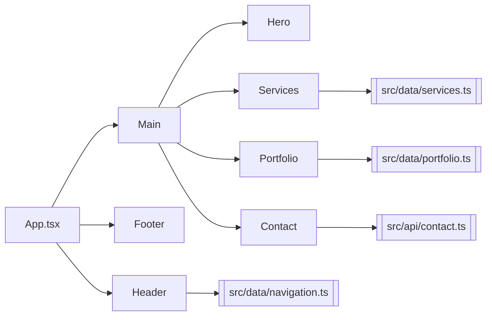

# Component Map — Arqing Visual

Breve mapa de componentes que describe responsabilidades, dependencias y relaciones.

## Resumen
- Propósito: Documento para entender la estructura de UI y responsabilidades de cada componente.
- Ubicación principal: `src/` (componentes en `src/components` y secciones en `src/components/sections`).

## Componentes principales

- `App.tsx` — Monta el layout principal y las secciones.
  - Responsabilidad: Composición de la app.
  - Usa: `components/layout/Header`, `components/layout/Footer`, secciones.

- `components/layout/Header` — Cabecera y navegación.
  - Responsabilidad: Mostrar logo y navegación, enlace a secciones.
  - Datos: `src/data/navigation.ts`.

- `components/layout/Footer` — Pie de página.
  - Responsabilidad: Información de contacto y créditos.

- `components/sections/Hero` — Sección `hero` principal.
  - Responsabilidad: Presentación inicial y llamado a la acción.

- `components/sections/Services` — Listado de servicios.
  - Responsabilidad: Mostrar `services` con tarjetas.
  - Datos: `src/data/services.ts`.

- `components/sections/Portfolio` — Galería de proyectos.
  - Responsabilidad: Mostrar `portfolioItems` (tarjetas o grid) y galerías.
  - Datos: `src/data/portfolio.ts`.

- `components/sections/Contact` — Formulario de contacto.
  - Responsabilidad: Capturar datos de contacto y enviarlos.
  - API: `src/api/contact.ts` (`submitContactForm`).

## Props / Eventos (resumen)
- `Header`: puede recibir `activeSection` o un handler de scroll (si implementado).
- `Services`: recibe lista `services` (o la importa internamente).
- `Portfolio`: recibe `portfolioItems` y callbacks para abrir modal/galería.
- `Contact`: internal state para formulario; usa `submitContactForm` para enviar.

## Dependencias de datos
- `src/data/navigation.ts` → `Header`
- `src/data/services.ts` → `Services`
- `src/data/portfolio.ts` → `Portfolio`
- `src/api/contact.ts` → `Contact`

## Diagrama (Mermaid)

---

Si quieres, puedo:
- Añadir props y tipos TypeScript esperados para cada componente.
- Generar un diagrama PNG/SVG a partir del Mermaid.
- Crear `docs/components.md` con más detalle y ejemplos de uso.
